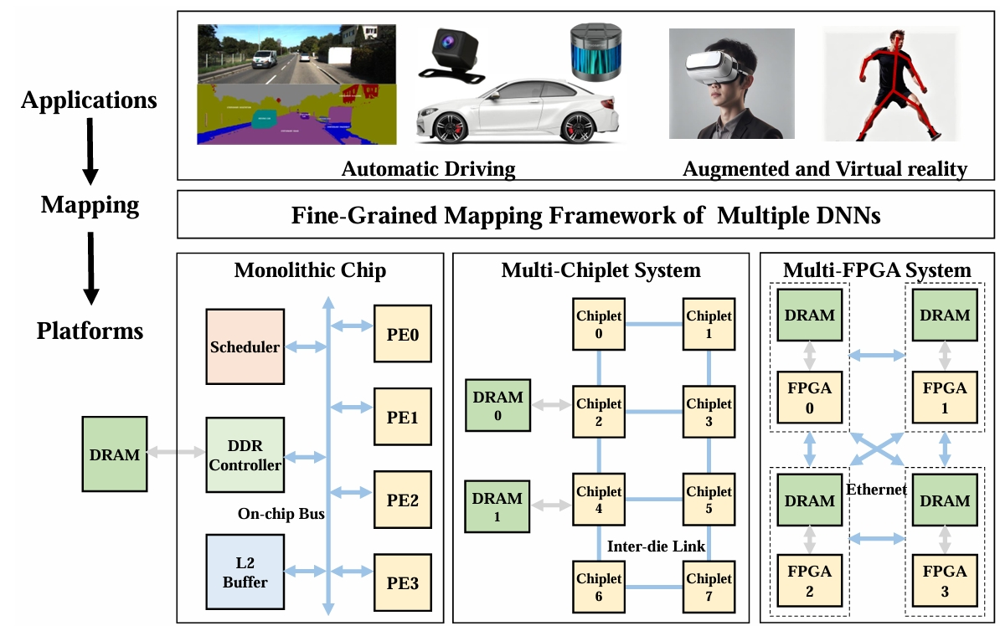

# M2M: A Fine-Grained Mapping Framework to Accelerate Multiple DNNs on a Multi-Chiplet Architecture

[](./LICENSE)

# Background: What is M2M?

M2M is a fine-grained mapping framework for accelerating multiple DNNs on a multiple-chiplet architecture. The challenges of mapping multiple DNNs on a multi-chiplet architecture includes distributed memory access, non-uniform latency, imbalanced traffic patterns as well as the increasing design space.



# Overview

```
M2M
│  run_SE.py
│  requirements.txt
│  README.md
│
├─gem5
│  ├─build_opts
│  ├─configs
│  ├─dnn_out
│  ├─ext
│  ├─include
│  ├─previous
│  ├─site_scons
│  ├─src
│  ├─system
│  ├─tests
│  ├─util
│
├─SE
│  ├─nn_input_noc_nop
│  ├─output_record
│  ├─result
│
├─MLF
│  ├─multi_nn_result
│  ├─SE_result
│
├─partition
├─comm_pattern
├─result_out
```

# Installation and Build

## Requirements for gem5

```
sudo apt install build-essential git m4 scons zlib1g zlib1g-dev libprotobuf-dev protobuf-compiler libprotoc-dev libgoogle-perftools-dev python-dev python
sudo apt install git
sudo apt install build-essential
sudo apt install scons
sudo apt install python3-dev
```

## Build gem5

```
cd gem5
source ./build.sh
```

## Requirments for python

```
pip install -r requirements.txt
```

# Run

## Loop optimization within each DNN layer

```
python run_SE.py
```

The mapping result of each DNN layer is shown in ``./SE/result/intraLayer/``

## Temporal and spatial block scheduling & Communication-aware block mapping

```
cd ./MLF
source ./run_vision.sh
source ./run_nlp.sh
source ./run_mixed.sh
```

## Validation

First we need to generate gem5 trace

```
cd ./SE
source ./validation.sh
```

We generate the gem5 trace in ``SE/dnn_task/*``

Then we run gem5

```
cd ./gem5
source for_run.sh
```

Finally, we compare the result with gem5

```
cd ./result_out
python extract_result.py
```
